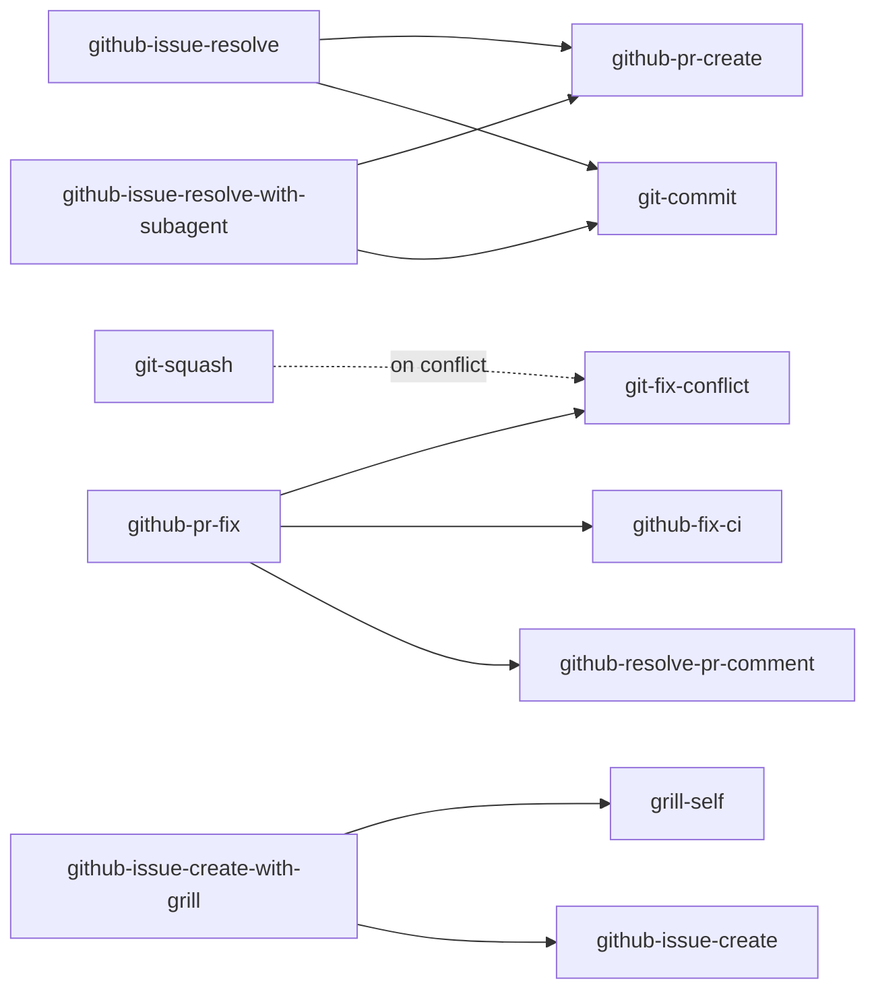

# Agent Skills

This document describes the AI agent skills bundled in this repository and how they depend on each other.

Skill sources live under [`config/ai-agents/skills/`](../config/ai-agents/skills) and are deployed by `install.sh` as symlinks into:

- `~/.agents/skills/<skill>` — shared skills directory
- `~/.claude/skills/<skill>` — Claude Code
- `~/.codex/skills/<skill>` — Codex
- `~/.gemini/antigravity-cli/skills/<skill>` — Antigravity CLI

Editing a file under `config/ai-agents/skills/` updates every agent at once via the symlink.

## Skill List

Each skill is a directory containing `SKILL.md`. The agent loads the front-matter `description` to decide when to use it.

### Git

| Skill                                                                      | Purpose                                                                               |
| -------------------------------------------------------------------------- | ------------------------------------------------------------------------------------- |
| [`git-commit`](../config/ai-agents/skills/git-commit/SKILL.md)             | Stage and commit the current changes in appropriate units                             |
| [`git-squash`](../config/ai-agents/skills/git-squash/SKILL.md)             | Squash / tidy commits on the current branch, force-with-lease push if needed          |
| [`git-fix-conflict`](../config/ai-agents/skills/git-fix-conflict/SKILL.md) | Detect and resolve conflicts from merge, rebase, cherry-pick, revert, apply, PR, etc. |

### GitHub Issue

| Skill                                                                                                          | Purpose                                                                                                                                                                                    |
| -------------------------------------------------------------------------------------------------------------- | ------------------------------------------------------------------------------------------------------------------------------------------------------------------------------------------ |
| [`github-issue-create`](../config/ai-agents/skills/github-issue-create/SKILL.md)                               | Gather information from the user and create a GitHub Issue                                                                                                                                 |
| [`github-issue-create-with-grill`](../config/ai-agents/skills/github-issue-create-with-grill/SKILL.md)         | One-shot: `grill-self` the design for a new issue, then `github-issue-create` with the decision log embedded                                                                               |
| [`github-issue-discover`](../config/ai-agents/skills/github-issue-discover/SKILL.md)                           | Scan the repo for issue-worthy items, dedupe vs existing issues, and bulk-create with approval (`--auto` skips)                                                                            |
| [`github-issue-update`](../config/ai-agents/skills/github-issue-update/SKILL.md)                               | Review open issues and close / annotate stale, resolved, duplicate, or outdated issues                                                                                                     |
| [`github-issue-polish`](../config/ai-agents/skills/github-issue-polish/SKILL.md)                               | Polish an issue until it is implementable as-is: codebase investigation, design decisions, trial implementation in a worktree                                                              |
| [`github-issue-resolve`](../config/ai-agents/skills/github-issue-resolve/SKILL.md)                             | End-to-end: investigate → discuss-or-implement decision → worktree → implement → PR for a given issue                                                                                      |
| [`github-issue-resolve-with-subagent`](../config/ai-agents/skills/github-issue-resolve-with-subagent/SKILL.md) | End-to-end: investigate → worktree → implement → PR for a given issue; implementation runs in subagents with a review/debug loop, commit and PR chain to `git-commit` / `github-pr-create` |

### GitHub Pull Request

| Skill                                                                                        | Purpose                                                                                              |
| -------------------------------------------------------------------------------------------- | ---------------------------------------------------------------------------------------------------- |
| [`github-pr-create`](../config/ai-agents/skills/github-pr-create/SKILL.md)                   | Create a Pull Request from the current branch                                                        |
| [`github-pr-review`](../config/ai-agents/skills/github-pr-review/SKILL.md)                   | Find issues with a general reviewer, verify each candidate, and replace the previous review snapshot |
| [`github-pr-fix`](../config/ai-agents/skills/github-pr-fix/SKILL.md)                         | Detect and fix all PR problems (conflicts, CI failures, review comments) inside a dedicated worktree |
| [`github-fix-ci`](../config/ai-agents/skills/github-fix-ci/SKILL.md)                         | Inspect CI status, analyze failures, and apply fixes                                                 |
| [`github-resolve-pr-comment`](../config/ai-agents/skills/github-resolve-pr-comment/SKILL.md) | Triage PR review comments and respond / address them                                                 |

### Planning & Design

| Skill                                                          | Purpose                                                                                                             |
| -------------------------------------------------------------- | ------------------------------------------------------------------------------------------------------------------- |
| [`grill-me`](../config/ai-agents/skills/grill-me/SKILL.md)     | Interactively grill the user about a plan / design, one question at a time, until every decision branch is resolved |
| [`grill-self`](../config/ai-agents/skills/grill-self/SKILL.md) | Autonomous grill: the agent investigates and resolves each design decision itself, then presents a decision log     |

### Docs & Notes

| Skill                                                      | Purpose                                                                                                    |
| ---------------------------------------------------------- | ---------------------------------------------------------------------------------------------------------- |
| [`doc-sync`](../config/ai-agents/skills/doc-sync/SKILL.md) | Diff repo docs (Markdown, docstrings, OpenAPI, config samples) against the implementation and update drift |
| [`md-note`](../config/ai-agents/skills/md-note/SKILL.md)   | Save the current conversation's research as a self-contained Japanese Markdown file                        |

### Japanese Writing

| Skill                                                                                | Purpose                                                                                                                                      |
| ------------------------------------------------------------------------------------ | -------------------------------------------------------------------------------------------------------------------------------------------- |
| [`japanese-tech-writing`](../config/ai-agents/skills/japanese-tech-writing/SKILL.md) | Style guide for writing and revising Japanese technical prose (formatting, paragraph-driven argument, removing LLM-flavored filler)          |
| [`stop-ai-slop-jp`](../config/ai-agents/skills/stop-ai-slop-jp/SKILL.md)             | Edit AI-generated Japanese back into human-written prose — fixes missing authorial stance, propositional H2s, false-balance, monotone rhythm |

Sources:

- `japanese-tech-writing` — based on [k16shikano/fd287c3133457c4fd8f5601d34aa817d](https://gist.github.com/k16shikano/fd287c3133457c4fd8f5601d34aa817d)

### Cross-Agent Consultation & Delegation

These skills are user-invoked only — the agent does not trigger them on its own.

`ask-*` runs the target CLI read-only for a second opinion. `do-*` runs it with edit permissions to delegate work that mutates the working tree.

| Skill                                                          | Purpose                                                                                                              |
| -------------------------------------------------------------- | -------------------------------------------------------------------------------------------------------------------- |
| [`ask-claude`](../config/ai-agents/skills/ask-claude/SKILL.md) | Ask Claude Code (`claude -p`) for a second opinion on an explicit user request                                       |
| [`ask-codex`](../config/ai-agents/skills/ask-codex/SKILL.md)   | Ask Codex (`codex exec`, read-only sandbox) for a second opinion on an explicit user request                         |
| [`ask-gemini`](../config/ai-agents/skills/ask-gemini/SKILL.md) | Ask Gemini via Antigravity CLI (`agy --sandbox -p`) for a second opinion on an explicit user request                 |
| [`do-claude`](../config/ai-agents/skills/do-claude/SKILL.md)   | Delegate a coding task to Claude Code (`claude -p --permission-mode bypassPermissions`) with edit permissions        |
| [`do-codex`](../config/ai-agents/skills/do-codex/SKILL.md)     | Delegate a coding task to Codex (`codex exec -s workspace-write`) with edit permissions                              |
| [`do-gemini`](../config/ai-agents/skills/do-gemini/SKILL.md)   | Delegate a coding task to Gemini via Antigravity CLI (`agy -p --dangerously-skip-permissions`) with edit permissions |

### Misc

| Skill                                                                          | Purpose                                                                                                                                 |
| ------------------------------------------------------------------------------ | --------------------------------------------------------------------------------------------------------------------------------------- |
| [`resume-other-agent`](../config/ai-agents/skills/resume-other-agent/SKILL.md) | Resume another coding agent (Codex / Claude Code) by session ID, replaying its prior context                                            |
| [`skill-review`](../config/ai-agents/skills/skill-review/SKILL.md)             | Validate Agent Skills compliance and report per-criterion verdicts, including trigger conflicts with nearby skills — no edits           |
| [`wezterm-control`](../config/ai-agents/skills/wezterm-control/SKILL.md)       | Drive wezterm panes / tabs / windows via `wezterm cli`: split, focus, resize, read pane contents, send commands and verify their output |

## Dependencies

The following skills invoke other skills through the agent's `Skill` tool. Arrows point from caller to callee.

### Caller → callee table

| Caller                               | Callee                                                           | When                                                                                |
| ------------------------------------ | ---------------------------------------------------------------- | ----------------------------------------------------------------------------------- |
| `git-squash`                         | `git-fix-conflict`                                               | Only if a conflict surfaces during squash                                           |
| `github-issue-resolve`               | `git-commit`, `github-pr-create`                                 | Implementation phase commits + final PR                                             |
| `github-issue-resolve-with-subagent` | `git-commit`, `github-pr-create`                                 | Phase 4 commits the worktree changes and creates the final PR                       |
| `github-issue-create-with-grill`     | `grill-self`, `github-issue-create`                              | Phase 2 grills the design, Phase 3 creates the issue with the decision log embedded |
| `github-pr-fix`                      | `git-fix-conflict`, `github-fix-ci`, `github-resolve-pr-comment` | Each callee runs only if the corresponding problem is detected                      |

### Standalone skills

These skills do not delegate to other skills:

`ask-claude`, `ask-codex`, `ask-gemini`, `do-claude`, `do-codex`, `do-gemini`, `doc-sync`, `git-commit`, `git-fix-conflict`, `github-fix-ci`, `github-issue-create`, `github-issue-discover`, `github-issue-polish`, `github-issue-update`, `github-pr-create`, `github-pr-review`, `github-resolve-pr-comment`, `grill-me`, `grill-self`, `japanese-tech-writing`, `md-note`, `resume-other-agent`, `skill-review`, `stop-ai-slop-jp`, `wezterm-control`.

## Conventions

- Skill names use kebab-case and are scoped by domain (`git-*`, `github-*`, plus a few generic ones).
- Front matter (`name`, `description`, `allowed-tools`) is the contract the agent reads — keep `description` rich enough to trigger correctly, and list `Skill(<dep>)` in `allowed-tools` for any sub-skill the body invokes.
- Client-specific fields such as `allowed-tools` may be ignored by unsupported agents. When present, follow the target client's current syntax and grant only the tools and command scopes the skill requires.
- When extending an existing skill's behavior, prefer calling the original skill via the `Skill` tool rather than duplicating its logic, so all agents pick up improvements in one place.
