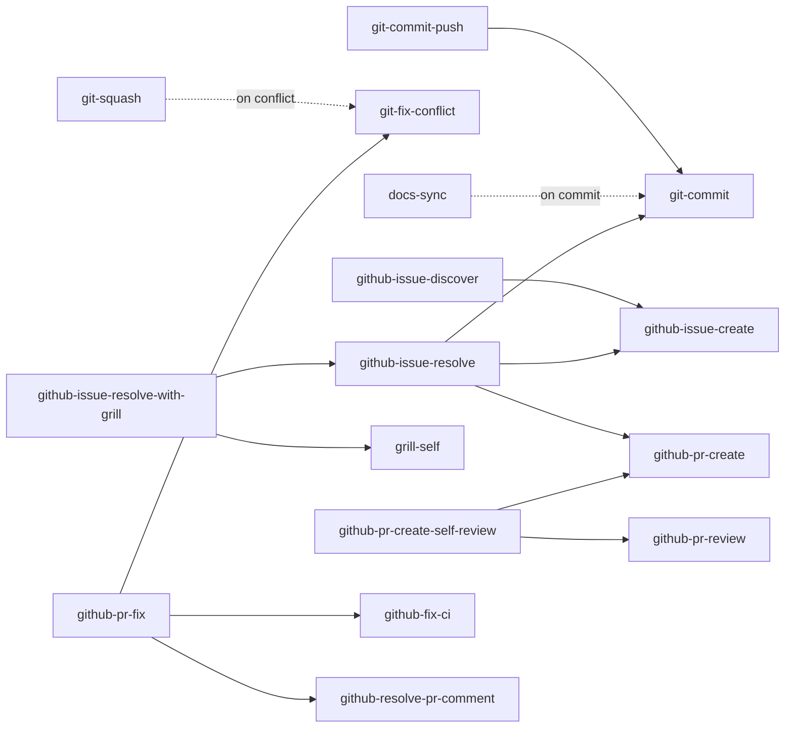

# Agent Skills

This document describes the AI agent skills bundled in this repository and how they depend on each other.

Skill sources live under [`config/ai-agents/skills/`](../config/ai-agents/skills) and are deployed by `install.sh` as symlinks into:

- `~/.agents/skills/<skill>` — shared skills directory
- `~/.claude/skills/<skill>` — Claude Code
- `~/.codex/skills/<skill>` — Codex
- `~/.gemini/antigravity-cli/skills/<skill>` — Antigravity CLI

Editing a file under `config/ai-agents/skills/` updates every agent at once via the symlink.

## Skill List

Each skill is a directory containing `SKILL.md`. The agent loads the front-matter `description` to decide when to use it.

### Git

| Skill                                                                      | Purpose                                                                               |
| -------------------------------------------------------------------------- | ------------------------------------------------------------------------------------- |
| [`git-commit`](../config/ai-agents/skills/git-commit/SKILL.md)             | Stage and commit the current changes in appropriate units                             |
| [`git-commit-push`](../config/ai-agents/skills/git-commit-push/SKILL.md)   | Run `git-commit`, then push the current branch                                        |
| [`git-squash`](../config/ai-agents/skills/git-squash/SKILL.md)             | Squash / tidy commits on the current branch, force-with-lease push if needed          |
| [`git-fix-conflict`](../config/ai-agents/skills/git-fix-conflict/SKILL.md) | Detect and resolve conflicts from merge, rebase, cherry-pick, revert, apply, PR, etc. |

### GitHub Issue

| Skill                                                                                                    | Purpose                                                                                                             |
| -------------------------------------------------------------------------------------------------------- | ------------------------------------------------------------------------------------------------------------------- |
| [`github-issue-create`](../config/ai-agents/skills/github-issue-create/SKILL.md)                         | Gather information from the user and create a GitHub Issue                                                          |
| [`github-issue-discover`](../config/ai-agents/skills/github-issue-discover/SKILL.md)                     | Scan the repo for issue-worthy items, dedupe vs existing issues, and bulk-create with approval (`--auto` skips)     |
| [`github-issue-update`](../config/ai-agents/skills/github-issue-update/SKILL.md)                         | Review open issues and close / annotate stale, resolved, duplicate, or outdated issues                              |
| [`github-issue-resolve`](../config/ai-agents/skills/github-issue-resolve/SKILL.md)                       | End-to-end: investigate → discuss-or-implement decision → worktree → implement → PR for a given issue               |
| [`github-issue-resolve-with-grill`](../config/ai-agents/skills/github-issue-resolve-with-grill/SKILL.md) | One-shot: `grill-self` the implementation plan for an issue, then `github-issue-resolve` guided by the decision log |

### GitHub Pull Request

| Skill                                                                                              | Purpose                                                                                               |
| -------------------------------------------------------------------------------------------------- | ----------------------------------------------------------------------------------------------------- |
| [`github-pr-create`](../config/ai-agents/skills/github-pr-create/SKILL.md)                         | Create a Pull Request from the current branch                                                         |
| [`github-pr-review`](../config/ai-agents/skills/github-pr-review/SKILL.md)                         | Run parallel reviewer subagents over a PR worktree and post an integrated review with inline comments |
| [`github-pr-create-self-review`](../config/ai-agents/skills/github-pr-create-self-review/SKILL.md) | One-shot: `github-pr-create` followed by `github-pr-review` against the resulting PR                  |
| [`github-pr-fix`](../config/ai-agents/skills/github-pr-fix/SKILL.md)                               | Detect and fix all PR problems (conflicts, CI failures, review comments) inside a dedicated worktree  |
| [`github-fix-ci`](../config/ai-agents/skills/github-fix-ci/SKILL.md)                               | Inspect CI status, analyze failures, and apply fixes                                                  |
| [`github-resolve-pr-comment`](../config/ai-agents/skills/github-resolve-pr-comment/SKILL.md)       | Triage PR review comments and respond / address them                                                  |

### Planning & Design

| Skill                                                          | Purpose                                                                                                             |
| -------------------------------------------------------------- | ------------------------------------------------------------------------------------------------------------------- |
| [`grill-me`](../config/ai-agents/skills/grill-me/SKILL.md)     | Interactively grill the user about a plan / design, one question at a time, until every decision branch is resolved |
| [`grill-self`](../config/ai-agents/skills/grill-self/SKILL.md) | Autonomous grill: the agent investigates and resolves each design decision itself, then presents a decision log     |

### Docs & Notes

| Skill                                                        | Purpose                                                                                                          |
| ------------------------------------------------------------ | ---------------------------------------------------------------------------------------------------------------- |
| [`docs-sync`](../config/ai-agents/skills/docs-sync/SKILL.md) | Diff repo docs (Markdown, docstrings, OpenAPI, config samples) against the implementation and update drift       |
| [`md-note`](../config/ai-agents/skills/md-note/SKILL.md)     | Save the current conversation's research as a self-contained Japanese Markdown file (`YYYYMMDD_*.md`) in the cwd |

### Cross-Agent Consultation

These skills are user-invoked only (`disable-model-invocation: true`) — the agent does not trigger them on its own.

| Skill                                                          | Purpose                                                                                              |
| -------------------------------------------------------------- | ---------------------------------------------------------------------------------------------------- |
| [`ask-claude`](../config/ai-agents/skills/ask-claude/SKILL.md) | Ask Claude Code (`claude -p`) for a second opinion on an explicit user request                       |
| [`ask-codex`](../config/ai-agents/skills/ask-codex/SKILL.md)   | Ask Codex (`codex exec`, read-only sandbox) for a second opinion on an explicit user request         |
| [`ask-gemini`](../config/ai-agents/skills/ask-gemini/SKILL.md) | Ask Gemini via Antigravity CLI (`agy --sandbox -p`) for a second opinion on an explicit user request |

### Misc

| Skill                                                                          | Purpose                                                                                      |
| ------------------------------------------------------------------------------ | -------------------------------------------------------------------------------------------- |
| [`resume-other-agent`](../config/ai-agents/skills/resume-other-agent/SKILL.md) | Resume another coding agent (Codex / Claude Code) by session ID, replaying its prior context |
| [`summarize-pdf`](../config/ai-agents/skills/summarize-pdf/SKILL.md)           | Summarize a PDF file                                                                         |

## Dependencies

The following skills invoke other skills through the agent's `Skill` tool. Arrows point from caller to callee.

### Caller → callee table

| Caller                            | Callee                                                                 | When                                                                                |
| --------------------------------- | ---------------------------------------------------------------------- | ----------------------------------------------------------------------------------- |
| `git-commit-push`                 | `git-commit`                                                           | Always (commit step before push)                                                    |
| `git-squash`                      | `git-fix-conflict`                                                     | Only if a conflict surfaces during squash                                           |
| `docs-sync`                       | `git-commit`                                                           | When the user opts into committing the doc updates                                  |
| `github-issue-discover`           | `github-issue-create`                                                  | One invocation per approved candidate (issued in parallel)                          |
| `github-issue-resolve`            | `github-issue-create` _(indirectly)_, `git-commit`, `github-pr-create` | Implementation phase commits + final PR                                             |
| `github-issue-resolve-with-grill` | `grill-self`, `github-issue-resolve`                                   | Phase 2 grills the design, Phase 3 implements per the decision log                  |
| `github-pr-create-self-review`    | `github-pr-create`, `github-pr-review`                                 | Phase 1 and Phase 3 of the one-shot flow                                            |
| `github-pr-fix`                   | `git-fix-conflict`, `github-fix-ci`, `github-resolve-pr-comment`       | Each callee runs only if the corresponding problem is detected                      |

### Standalone skills

These skills do not delegate to other skills:

`ask-claude`, `ask-codex`, `ask-gemini`, `git-commit`, `git-fix-conflict`, `github-fix-ci`, `github-issue-create`, `github-issue-update`, `github-pr-create`, `github-pr-review`, `github-resolve-pr-comment`, `grill-me`, `grill-self`, `md-note`, `resume-other-agent`, `summarize-pdf`.

Note: `github-issue-update` mentions `github-issue-discover` / `github-pr-review` / `github-resolve-pr-comment` in its SKILL.md only to clarify scope boundaries — it deliberately does not invoke them.

## Conventions

- Skill names use kebab-case and are scoped by domain (`git-*`, `github-*`, plus a few generic ones).
- Front matter (`name`, `description`, `allowed-tools`) is the contract the agent reads — keep `description` rich enough to trigger correctly, and list `Skill(<dep>)` in `allowed-tools` for any sub-skill the body invokes.
- When extending an existing skill's behavior, prefer calling the original skill via the `Skill` tool rather than duplicating its logic, so all agents pick up improvements in one place.
