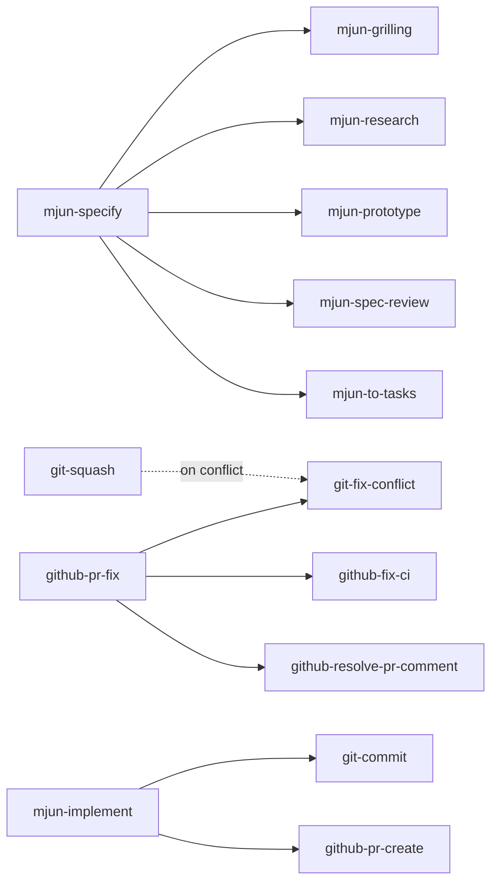

# Agent Skills

This document describes the AI agent skills used from this repository and how they depend on each other. Skills come from two sources.

Private skills (`mjun-*`, `herdr`, `self-review`, `agent-browser`) live under [`config/ai-agents/skills/`](../config/ai-agents/skills) and are deployed by `install.sh` as symlinks into:

- `~/.agents/skills/<skill>` — shared skills directory (Codex reads this directory directly)
- `~/.claude/skills/<skill>` — Claude Code
- `~/.gemini/antigravity-cli/skills/<skill>` — Antigravity CLI

Editing a file under `config/ai-agents/skills/` updates every agent at once via the symlink.

The other skills (and the code-reviewer agents) are subscribed from [mjun0812/skills](https://github.com/mjun0812/skills) via apm. The subscription is declared in [`config/ai-agents/apm.yml`](../config/ai-agents/apm.yml) and `install.sh` runs `apm update -g -y` to deploy it; their links below point at the upstream repository.

## Skill List

Each skill is a directory containing `SKILL.md`. The agent loads the front-matter `description` to decide when to use it.

### Development Flow (mjun)

The self-authored dev-flow skill suite under the `mjun-` prefix. Specs always live in `.mjun/specs/` as the source of truth, and GitHub issues act as import/projection adapters. The entry point is `mjun-specify`; after contract approval it breaks the spec into tasks when needed, and `mjun-implement` carries it through to a PR. Every skill reads `.mjun/CONTEXT.md` (glossary) and `.mjun/adr/` (decision records) before working; `mjun-specify` appends glossary terms as they settle, and `mjun-implement` projects decisions from `decisions.md` into ADRs on delivery, only when all three conditions hold (hard to reverse, surprising without context, a real trade-off).

| Skill                                                                      | Purpose                                                                                                                                                                                                                                                                                                                                                                                                                                                                                                                                                                                                                                                                                                                                                                                                                                                                                                                                                                                                                                                                                                                                                       |
| -------------------------------------------------------------------------- | ------------------------------------------------------------------------------------------------------------------------------------------------------------------------------------------------------------------------------------------------------------------------------------------------------------------------------------------------------------------------------------------------------------------------------------------------------------------------------------------------------------------------------------------------------------------------------------------------------------------------------------------------------------------------------------------------------------------------------------------------------------------------------------------------------------------------------------------------------------------------------------------------------------------------------------------------------------------------------------------------------------------------------------------------------------------------------------------------------------------------------------------------------------- |
| [`mjun-specify`](../config/ai-agents/skills/mjun-specify/SKILL.md)         | Polish an idea, GitHub issue, or local markdown into an implementable spec (contract): investigate facts, resolve agent-owned decisions autonomously, confirm human-owned or uncertain ones one at a time, always write design.md (the implementation design inside the contract) once decisions settle, auto-run task breakdown for multi-task specs, then project the approved contract with the task checklist to the issue (local-only specs are offered a projection-target issue at that point) Before asking for approval, `mjun-spec-review` checks the contract and design.md in a fresh context. Only directly spawned subagents are non-delegating leaf roles; delegation inside callee skills follows each skill's own rules                                                                                                                                                                                                                                                                                                                                                                                                                      |
| [`mjun-grilling`](../config/ai-agents/skills/mjun-grilling/SKILL.md)       | Resolve plan / design / spec decisions interactively in rounds: ask the whole frontier (decisions whose prerequisites are settled) with recommended answers, dispatch fact-finding to subagents without blocking, and continue until the design tree is exhausted (whole-design mode) or resolve one handed-over decision (single-decision mode); never acts before shared understanding is confirmed                                                                                                                                                                                                                                                                                                                                                                                                                                                                                                                                                                                                                                                                                                                                                         |
| [`mjun-research`](../config/ai-agents/skills/mjun-research/SKILL.md)       | Investigate external facts from primary sources (official docs, library source, specs), save each claim with a citation to the local spec, and return the evidence to the caller without posting to GitHub                                                                                                                                                                                                                                                                                                                                                                                                                                                                                                                                                                                                                                                                                                                                                                                                                                                                                                                                                    |
| [`mjun-prototype`](../config/ai-agents/skills/mjun-prototype/SKILL.md)     | Answer a UI / state / logic design question that talking cannot settle with one throwaway prototype per question                                                                                                                                                                                                                                                                                                                                                                                                                                                                                                                                                                                                                                                                                                                                                                                                                                                                                                                                                                                                                                              |
| [`mjun-spec-review`](../config/ai-agents/skills/mjun-spec-review/SKILL.md) | Adversarially review a spec (`.mjun/specs/<slug>`, a GitHub issue or PR number, any design markdown, or the design discussed in the conversation) on two axes: a fresh-context contract reviewer (self-consistency, verifiable acceptance criteria, drift from the source, existence of cited evidence) and a design reviewer (contract coverage, boundaries, fit with the codebase, failure paths, test seams, structural excess or gaps) produce candidates, then a verifier per candidate tries to refute it against real code and the contract text; only confirmed findings are returned to chat. Never edits files                                                                                                                                                                                                                                                                                                                                                                                                                                                                                                                                      |
| [`mjun-to-tasks`](../config/ai-agents/skills/mjun-to-tasks/SKILL.md)       | Persist a spec as independently verifiable vertical-slice tasks in tasks.md, including single-task specs. Before saving, an internal coverage check maps requirements, acceptance criteria, and the design’s modules / seams / data flow onto tasks and repairs gaps (max 2 rounds), and for multi-task plans a fresh-context task-plan reviewer inspects hidden prerequisites, ordering, boundary overlap, oversized tasks, and integration placement; completed tasks whose acceptance criteria change return to ready, while blocked tasks keep their reason and resume condition until the blocker is demonstrably resolved. Task size is judged by verifiable-deliverable (one failing command per task), change confined to one design module, single responsibility, prerequisites as preceding tasks, a `Done when` line, and AC ≤ 3 as a split heuristic; each task carries a Seam and no file paths                                                                                                                                                                                                                                                 |
| [`mjun-implement`](../config/ai-agents/skills/mjun-implement/SKILL.md)     | Gate the spec on explicit contract approval and content (issue numbers resolve via Source lookup; unimported issues are routed to mjun-specify), implement task by task in a worktree via implementer/reviewer subagents, resume from the branch recorded in tasks.md, verify acceptance criteria and contract boundaries, then commit and optionally open a PR Before each task a verifier subagent turns the acceptance criteria into failing executable checks and retries a bounded number of distinct verification methods when necessary. Oversized tasks and task decomposition or ordering failures are repaired automatically only when contract meaning is preserved; unresolved tasks are isolated so independent tasks can continue, and the final report lists blockers, resume conditions, and dependent tasks left waiting. A fresh-context debugger classifies non-converging failures, feature validation covers smoke, AC matrix and cross-task consistency, and a refactor pass cleans up under green checks. Every subagent is a leaf role that cannot re-delegate; only the main conversation brokers handoffs and additional delegation |
| [`mjun-steering`](../config/ai-agents/skills/mjun-steering/SKILL.md)       | Maintain `.mjun/steering/` as implementation-grounded project memory: bootstrap from the codebase, sync with drift detection, and mine history (merged PRs, closed issues, docs) into the glossary `.mjun/CONTEXT.md` and provenance-tagged ADRs in `.mjun/adr/` (append-only)                                                                                                                                                                                                                                                                                                                                                                                                                                                                                                                                                                                                                                                                                                                                                                                                                                                                                |
| [`mjun-status`](../config/ai-agents/skills/mjun-status/SKILL.md)           | Derive and display the status of local specs (contract approval, task progress, blocked-task reasons and resume conditions, implementation branch, projected issue) from `.mjun/specs/` and git without any index file; read-only                                                                                                                                                                                                                                                                                                                                                                                                                                                                                                                                                                                                                                                                                                                                                                                                                                                                                                                             |

### Git

| Skill                                                                                                   | Purpose                                                                                                                                                |
| ------------------------------------------------------------------------------------------------------- | ------------------------------------------------------------------------------------------------------------------------------------------------------ |
| [`git-commit`](https://github.com/mjun0812/skills/blob/main/skills/git/git-commit/SKILL.md)             | Stage and commit the current changes in appropriate units                                                                                              |
| [`git-squash`](https://github.com/mjun0812/skills/blob/main/skills/git/git-squash/SKILL.md)             | Squash / tidy commits on the current branch, force-with-lease push if needed                                                                           |
| [`git-fix-conflict`](https://github.com/mjun0812/skills/blob/main/skills/git/git-fix-conflict/SKILL.md) | Detect and resolve conflicts from merge, rebase, cherry-pick, revert, apply, PR, etc.                                                                  |
| [`self-review`](../config/ai-agents/skills/self-review/SKILL.md)                                        | Adversarially review uncommitted changes or one specified commit with two independent Finders (`--spec` adds a contract axis checked against the spec) |

### GitHub

| Skill                                                                                                                        | Purpose                                                                                                                                                                                                             |
| ---------------------------------------------------------------------------------------------------------------------------- | ------------------------------------------------------------------------------------------------------------------------------------------------------------------------------------------------------------------- |
| [`github-issue-create`](https://github.com/mjun0812/skills/blob/main/skills/github/github-issue-create/SKILL.md)             | Create one GitHub issue from a todo, memo, or bug note after verifying its claims (repo, then official docs when needed) and searching related issues (template and label auto-selection, approval before creation) |
| [`github-issue-update`](https://github.com/mjun0812/skills/blob/main/skills/github/github-issue-update/SKILL.md)             | Inspect open issues and propose closes (resolved, duplicate, stale), comments, and label changes, then apply them in bulk after approval                                                                            |
| [`github-pr-create`](https://github.com/mjun0812/skills/blob/main/skills/github/github-pr-create/SKILL.md)                   | Create a Pull Request from the current branch with a six-part description covering overview and background, related issues, implementation approach, changes, impact, and validation results                        |
| [`github-pr-review`](https://github.com/mjun0812/skills/blob/main/skills/github/github-pr-review/SKILL.md)                   | Find merge-blocking issues, standards findings, and spec mismatches (when a spec resolves via `--spec` or a linked issue) with parallel reviewers, verify each candidate, and replace the previous review snapshot  |
| [`github-pr-fix`](https://github.com/mjun0812/skills/blob/main/skills/github/github-pr-fix/SKILL.md)                         | Detect and fix all PR problems (conflicts, CI failures, review comments) inside a dedicated worktree                                                                                                                |
| [`github-fix-ci`](https://github.com/mjun0812/skills/blob/main/skills/github/github-fix-ci/SKILL.md)                         | Inspect CI status, analyze failures, and apply fixes                                                                                                                                                                |
| [`github-resolve-pr-comment`](https://github.com/mjun0812/skills/blob/main/skills/github/github-resolve-pr-comment/SKILL.md) | Triage PR review comments and respond / address them                                                                                                                                                                |

### Planning & Design

| Skill                                                                                                      | Purpose                                                                                                                |
| ---------------------------------------------------------------------------------------------------------- | ---------------------------------------------------------------------------------------------------------------------- |
| [`experiment-plan`](https://github.com/mjun0812/skills/blob/main/skills/planning/experiment-plan/SKILL.md) | Interview the user one decision at a time and save a testable machine-learning experiment plan to `.mjun/experiments/` |

### Docs & Notes

| Skill                                                                                    | Purpose                                                                                                    |
| ---------------------------------------------------------------------------------------- | ---------------------------------------------------------------------------------------------------------- |
| [`doc-sync`](https://github.com/mjun0812/skills/blob/main/skills/docs/doc-sync/SKILL.md) | Diff repo docs (Markdown, docstrings, OpenAPI, config samples) against the implementation and update drift |
| [`md-note`](https://github.com/mjun0812/skills/blob/main/skills/docs/md-note/SKILL.md)   | Save the current conversation's research as a self-contained Japanese Markdown file                        |

### Japanese Writing

| Skill                                                                                                                 | Purpose                                                                                                                                      |
| --------------------------------------------------------------------------------------------------------------------- | -------------------------------------------------------------------------------------------------------------------------------------------- |
| [`japanese-tech-writing`](https://github.com/mjun0812/skills/blob/main/skills/writing/japanese-tech-writing/SKILL.md) | Style guide for writing and revising Japanese technical prose (formatting, paragraph-driven argument, removing LLM-flavored filler)          |
| [`stop-ai-slop-jp`](https://github.com/mjun0812/skills/blob/main/skills/writing/stop-ai-slop-jp/SKILL.md)             | Edit AI-generated Japanese back into human-written prose — fixes missing authorial stance, propositional H2s, false-balance, monotone rhythm |

Sources:

- `japanese-tech-writing` — based on [k16shikano/fd287c3133457c4fd8f5601d34aa817d](https://gist.github.com/k16shikano/fd287c3133457c4fd8f5601d34aa817d)

### Cross-Agent Consultation & Delegation

These skills are user-invoked only — the agent does not trigger them on its own.

Each skill defaults to a read-only consultation mode, and runs with edit permissions only when the user explicitly asks to delegate work. An agent never uses the skill for its own CLI.

| Skill                                                                                      | Purpose                                                                                   |
| ------------------------------------------------------------------------------------------ | ----------------------------------------------------------------------------------------- |
| [`claude`](https://github.com/mjun0812/skills/blob/main/skills/delegation/claude/SKILL.md) | Consult Claude Code (`claude -p`, read-only) or delegate work to it with edit permissions |
| [`codex`](https://github.com/mjun0812/skills/blob/main/skills/delegation/codex/SKILL.md)   | Consult Codex (`codex exec`, read-only sandbox) or delegate work via `workspace-write`    |

### Misc

| Skill                                                                                                              | Purpose                                                                                                                                                                                                                                                                              |
| ------------------------------------------------------------------------------------------------------------------ | ------------------------------------------------------------------------------------------------------------------------------------------------------------------------------------------------------------------------------------------------------------------------------------ |
| [`agent-browser`](../config/ai-agents/skills/agent-browser/SKILL.md)                                               | Browser automation via the `agent-browser` CLI (vendored upstream stub; usage is loaded at runtime with `agent-browser skills get core`)                                                                                                                                             |
| [`herdr`](../config/ai-agents/skills/herdr/SKILL.md)                                                               | Control herdr panes / tabs / workspaces from inside a herdr-managed pane (vendored from the binary via `herdr --skill`; regenerated by `setup_herdr.sh` on upgrade)                                                                                                                  |
| [`resume-other-agent`](https://github.com/mjun0812/skills/blob/main/skills/delegation/resume-other-agent/SKILL.md) | Resume another coding agent (Codex / Claude Code) by session ID, replaying its prior context                                                                                                                                                                                         |
| [`skill-review`](https://github.com/mjun0812/skills/blob/main/skills/review/skill-review/SKILL.md)                 | Validate Agent Skills compliance and report per-criterion verdicts, including trigger conflicts with nearby skills and leftovers of superseded criteria; after a review, proposes rules that emerged from the fixes and, on approval, appends them to its own criteria and CHANGELOG |
| [`wezterm-control`](https://github.com/mjun0812/skills/blob/main/skills/tools/wezterm-control/SKILL.md)            | Drive wezterm panes / tabs / windows via `wezterm cli`: split, focus, resize, read pane contents, send commands and verify their output                                                                                                                                              |

## Dependencies

The following skills invoke other skills through the agent's `Skill` tool. Arrows point from caller to callee.

```mermaid
graph LR
    git-squash -. on conflict .-> git-fix-conflict

    mjun-specify --> mjun-grilling
    mjun-specify --> mjun-research
    mjun-specify --> mjun-prototype
    mjun-specify --> mjun-spec-review
    mjun-specify --> mjun-to-tasks

    mjun-implement --> git-commit
    mjun-implement --> github-pr-create

    github-pr-fix --> git-fix-conflict
    github-pr-fix --> github-fix-ci
    github-pr-fix --> github-resolve-pr-comment
```

### Caller → callee table

| Caller           | Callee                                                           | When                                                                                               |
| ---------------- | ---------------------------------------------------------------- | -------------------------------------------------------------------------------------------------- |
| `git-squash`     | `git-fix-conflict`                                               | Only if a conflict surfaces during squash                                                          |
| `mjun-specify`   | `mjun-grilling`, `mjun-research`, `mjun-prototype`               | When a human-owned / evidence-blocked decision needs resolving                                     |
| `mjun-specify`   | `mjun-spec-review`                                               | Phase 5.5 (before approval) reviews the contract and design.md; only valid findings are applied    |
| `mjun-specify`   | `mjun-to-tasks`                                                  | Auto-chained after contract approval for multi-task specs, or to re-decompose an existing tasks.md |
| `mjun-implement` | `git-commit`, `github-pr-create`                                 | Phase 4 commits the worktree changes; PR only with `--pr`                                          |
| `github-pr-fix`  | `git-fix-conflict`, `github-fix-ci`, `github-resolve-pr-comment` | Each callee runs only if the corresponding problem is detected                                     |

### Standalone skills

These skills do not delegate to other skills:

`agent-browser`, `claude`, `codex`, `doc-sync`, `experiment-plan`, `git-commit`, `git-fix-conflict`, `github-fix-ci`, `github-issue-create`, `github-issue-update`, `github-pr-create`, `github-pr-review`, `github-resolve-pr-comment`, `herdr`, `japanese-tech-writing`, `md-note`, `mjun-grilling`, `mjun-prototype`, `mjun-research`, `mjun-spec-review`, `mjun-status`, `mjun-steering`, `mjun-to-tasks`, `resume-other-agent`, `self-review`, `skill-review`, `stop-ai-slop-jp`, `wezterm-control`.

## Conventions

- Skill names use kebab-case and are scoped by domain (`git-*`, `github-*`, plus a few generic ones).
- Front matter (`name`, `description`, `allowed-tools`) is the contract the agent reads — keep `description` rich enough to trigger correctly, and list `Skill(<dep>)` in `allowed-tools` for any sub-skill the body invokes.
- Client-specific fields such as `allowed-tools` may be ignored by unsupported agents. When present, follow the target client's current syntax and grant only the tools and command scopes the skill requires.
- When extending an existing skill's behavior, prefer calling the original skill via the `Skill` tool rather than duplicating its logic, so all agents pick up improvements in one place.
