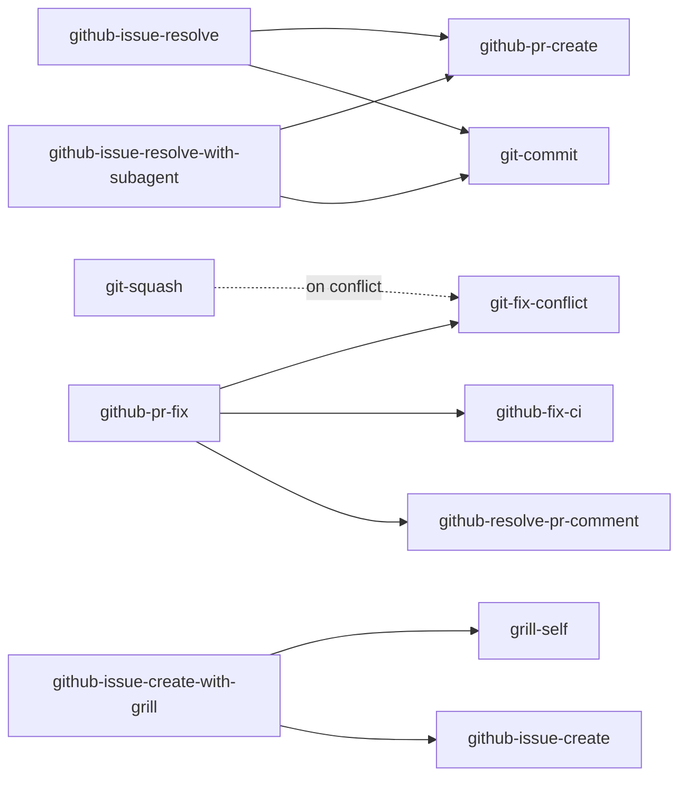

# Agent Skills

このドキュメントは、本リポジトリに同梱されているAI agent skillと、それらの依存関係について説明します。

Skillのソースは [`config/ai-agents/skills/`](../config/ai-agents/skills) 配下にあり、`install.sh` によって以下へsymlinkとしてデプロイされます。

- `~/.agents/skills/<skill>` — 共有skillディレクトリ
- `~/.claude/skills/<skill>` — Claude Code
- `~/.codex/skills/<skill>` — Codex
- `~/.gemini/antigravity-cli/skills/<skill>` — Antigravity CLI

`config/ai-agents/skills/` 配下のファイルを編集すると、symlink経由ですべてのagentに同時に反映されます。

## Skill一覧

各skillは `SKILL.md` を含むディレクトリです。Agentはfront-matterの `description` を読んで、いつ使うかを判断します。

### Git

| Skill                                                                      | 用途                                                                                       |
| -------------------------------------------------------------------------- | ------------------------------------------------------------------------------------------ |
| [`git-commit`](../config/ai-agents/skills/git-commit/SKILL.md)             | 現在の変更を適切な単位でstaging・commitする                                                |
| [`git-squash`](../config/ai-agents/skills/git-squash/SKILL.md)             | 現在のbranchのcommitをsquash・整理し、必要なら force-with-lease でpushする                 |
| [`git-fix-conflict`](../config/ai-agents/skills/git-fix-conflict/SKILL.md) | merge、rebase、cherry-pick、revert、apply、PR などで発生したコンフリクトを検出して解消する |

### GitHub Issue

| Skill                                                                                                          | 用途                                                                                                                                                                |
| -------------------------------------------------------------------------------------------------------------- | ------------------------------------------------------------------------------------------------------------------------------------------------------------------- |
| [`github-issue-create`](../config/ai-agents/skills/github-issue-create/SKILL.md)                               | ユーザーから情報を収集してGitHub Issueを作成する                                                                                                                    |
| [`github-issue-create-with-grill`](../config/ai-agents/skills/github-issue-create-with-grill/SKILL.md)         | ワンショット: 新規issueの設計を `grill-self` で詰めた上で、決定ログを埋め込んで `github-issue-create` を実行する                                                    |
| [`github-issue-discover`](../config/ai-agents/skills/github-issue-discover/SKILL.md)                           | リポジトリをスキャンしてissue化すべき事項を発見し、既存issueとの重複を除いた上で承認のもと一括起票する（`--auto` で承認をスキップ）                                 |
| [`github-issue-update`](../config/ai-agents/skills/github-issue-update/SKILL.md)                               | open issueを点検し、古い・解決済み・重複・陳腐化したissueをclose／追記する                                                                                          |
| [`github-issue-polish`](../config/ai-agents/skills/github-issue-polish/SKILL.md)                               | issueを「issueだけで実装できる」状態まで磨き上げる: コードベース調査・設計判断・worktreeでのお試し実装                                                              |
| [`github-issue-resolve`](../config/ai-agents/skills/github-issue-resolve/SKILL.md)                             | 一気通貫: 指定issueの調査 → 議論または実装判断 → worktree作成 → 実装 → PR作成                                                                                       |
| [`github-issue-resolve-with-subagent`](../config/ai-agents/skills/github-issue-resolve-with-subagent/SKILL.md) | 一気通貫: 指定issueの調査 → worktree作成 → 実装 → PR作成。実装はSubAgentのreview/debugループで検証し、commitとPR作成は `git-commit` / `github-pr-create` に連結する |

### GitHub Pull Request

| Skill                                                                                        | 用途                                                                                 |
| -------------------------------------------------------------------------------------------- | ------------------------------------------------------------------------------------ |
| [`github-pr-create`](../config/ai-agents/skills/github-pr-create/SKILL.md)                   | 現在のbranchからPull Requestを作成する                                               |
| [`github-pr-review`](../config/ai-agents/skills/github-pr-review/SKILL.md)                   | 汎用reviewerで指摘を発見・検証し、以前のレビューを最新スナップショットへ置き換える   |
| [`github-pr-fix`](../config/ai-agents/skills/github-pr-fix/SKILL.md)                         | PRの全問題（コンフリクト、CI失敗、レビューコメント）を専用worktree内で検出・修正する |
| [`github-fix-ci`](../config/ai-agents/skills/github-fix-ci/SKILL.md)                         | CIのステータスを確認し、失敗を分析して修正を適用する                                 |
| [`github-resolve-pr-comment`](../config/ai-agents/skills/github-resolve-pr-comment/SKILL.md) | PRのレビューコメントを確認し、対応・返信する                                         |

### Planning & Design

| Skill                                                          | 用途                                                                                        |
| -------------------------------------------------------------- | ------------------------------------------------------------------------------------------- |
| [`grill-me`](../config/ai-agents/skills/grill-me/SKILL.md)     | 計画・設計について、すべての意思決定分岐が解消されるまで1問ずつユーザーに対話的に問いかける |
| [`grill-self`](../config/ai-agents/skills/grill-self/SKILL.md) | 自律grill: agentが自分で調査し各設計判断を解消した上で、最後に決定ログを提示する            |

### Docs & Notes

| Skill                                                      | 用途                                                                                                       |
| ---------------------------------------------------------- | ---------------------------------------------------------------------------------------------------------- |
| [`doc-sync`](../config/ai-agents/skills/doc-sync/SKILL.md) | リポジトリ内のドキュメント（Markdown、docstring、OpenAPI、設定サンプル）を実装と差分比較し、乖離を更新する |
| [`md-note`](../config/ai-agents/skills/md-note/SKILL.md)   | 現在の会話の調査内容を、自己完結型の日本語Markdownファイルとして保存する                                   |

### Japanese Writing

| Skill                                                                                | 用途                                                                                                         |
| ------------------------------------------------------------------------------------ | ------------------------------------------------------------------------------------------------------------ |
| [`japanese-tech-writing`](../config/ai-agents/skills/japanese-tech-writing/SKILL.md) | 日本語の技術文書・書籍原稿を書く／推敲するときの文章規範（整形、パラグラフライティング、LLM 臭の排除など）   |
| [`stop-ai-slop-jp`](../config/ai-agents/skills/stop-ai-slop-jp/SKILL.md)             | AIで書いた日本語を人間が書いた文章に戻す編集規範（主体の不在、命題型H2、両論併記、リズムの均一さなどを直す） |

出典:

- `japanese-tech-writing` — [k16shikano/fd287c3133457c4fd8f5601d34aa817d](https://gist.github.com/k16shikano/fd287c3133457c4fd8f5601d34aa817d) を元にしている

### Cross-Agent Consultation & Delegation

これらはuser-invoked専用で、agentが自発的に起動することはありません。

`ask-*` は対象CLIをread-onlyで呼び出し、セカンドオピニオンを得るためのskillです。`do-*` は編集権限付きで呼び出し、ワーキングツリーを変更する作業を委譲するためのskillです。

| Skill                                                          | 用途                                                                                                             |
| -------------------------------------------------------------- | ---------------------------------------------------------------------------------------------------------------- |
| [`ask-claude`](../config/ai-agents/skills/ask-claude/SKILL.md) | Claude Code (`claude -p`) に明示的なユーザー依頼へのセカンドオピニオンを求める                                   |
| [`ask-codex`](../config/ai-agents/skills/ask-codex/SKILL.md)   | Codex (`codex exec`, read-onlyサンドボックス) に明示的なユーザー依頼へのセカンドオピニオンを求める               |
| [`ask-gemini`](../config/ai-agents/skills/ask-gemini/SKILL.md) | Antigravity CLI (`agy --sandbox -p`) 経由でGeminiに明示的なユーザー依頼へのセカンドオピニオンを求める            |
| [`do-claude`](../config/ai-agents/skills/do-claude/SKILL.md)   | Claude Code (`claude -p --permission-mode bypassPermissions`) に編集権限付きでコーディング作業を委譲する         |
| [`do-codex`](../config/ai-agents/skills/do-codex/SKILL.md)     | Codex (`codex exec -s workspace-write`) に編集権限付きでコーディング作業を委譲する                               |
| [`do-gemini`](../config/ai-agents/skills/do-gemini/SKILL.md)   | Antigravity CLI (`agy -p --dangerously-skip-permissions`) 経由でGeminiに編集権限付きでコーディング作業を委譲する |

### Misc

| Skill                                                                          | 用途                                                                                                                    |
| ------------------------------------------------------------------------------ | ----------------------------------------------------------------------------------------------------------------------- |
| [`resume-other-agent`](../config/ai-agents/skills/resume-other-agent/SKILL.md) | 別のcoding agent（Codex / Claude Code）をsession IDで指定し、直前のcontextを復元してresumeする                          |
| [`skill-review`](../config/ai-agents/skills/skill-review/SKILL.md)             | Agent skillの仕様適合性を検証し、周辺skillとの発動競合を含む観点ごとの判定をレポートする。評価のみで編集はしない        |
| [`wezterm-control`](../config/ai-agents/skills/wezterm-control/SKILL.md)       | weztermのpane/tab/windowを `wezterm cli` で操作する。分割・フォーカス・リサイズ・内容の読み取り・コマンド送信と結果検証 |

## Dependencies

以下のskillはagentの `Skill` tool経由で他のskillを呼び出します。矢印はcallerからcalleeへ向かいます。

### Caller → callee 表

| Caller                               | Callee                                                           | タイミング                                                   |
| ------------------------------------ | ---------------------------------------------------------------- | ------------------------------------------------------------ |
| `git-squash`                         | `git-fix-conflict`                                               | squash中にコンフリクトが発生した場合のみ                     |
| `github-issue-resolve`               | `git-commit`, `github-pr-create`                                 | 実装フェーズのcommitと最終的なPR作成                         |
| `github-issue-resolve-with-subagent` | `git-commit`, `github-pr-create`                                 | Phase 4でworktreeの変更をcommitし、最終的なPRを作成          |
| `github-issue-create-with-grill`     | `grill-self`, `github-issue-create`                              | Phase 2で設計をgrill、Phase 3で決定ログを埋め込んでissue作成 |
| `github-pr-fix`                      | `git-fix-conflict`, `github-fix-ci`, `github-resolve-pr-comment` | 対応する問題が検出された場合のみ各calleeを実行               |

### Standalone skills

以下のskillは他のskillへ委譲しません。

`ask-claude`, `ask-codex`, `ask-gemini`, `do-claude`, `do-codex`, `do-gemini`, `doc-sync`, `git-commit`, `git-fix-conflict`, `github-fix-ci`, `github-issue-create`, `github-issue-discover`, `github-issue-polish`, `github-issue-update`, `github-pr-create`, `github-pr-review`, `github-resolve-pr-comment`, `grill-me`, `grill-self`, `japanese-tech-writing`, `md-note`, `resume-other-agent`, `skill-review`, `stop-ai-slop-jp`, `wezterm-control`.

## Conventions

- Skill名はkebab-caseで、ドメイン単位（`git-*`、`github-*`、いくつかの汎用skill）にスコープされます。
- Front matter（`name`、`description`、`allowed-tools`）はagentが読む契約です。`description` はskillが正しくトリガーされるよう十分に具体的に書き、本体から呼び出すsub-skillは `allowed-tools` に `Skill(<dep>)` として記載してください。
- `allowed-tools`などのクライアント固有fieldは未対応agentで無視される場合があります。指定する場合は対象クライアントの現行構文に従い、skillに必要なtoolとコマンド範囲だけを許可してください。
- 既存skillの挙動を拡張する場合は、ロジックを複製するのではなく `Skill` tool経由で元のskillを呼び出すことを優先してください。改善がすべてのagentに一箇所で行き渡ります。
