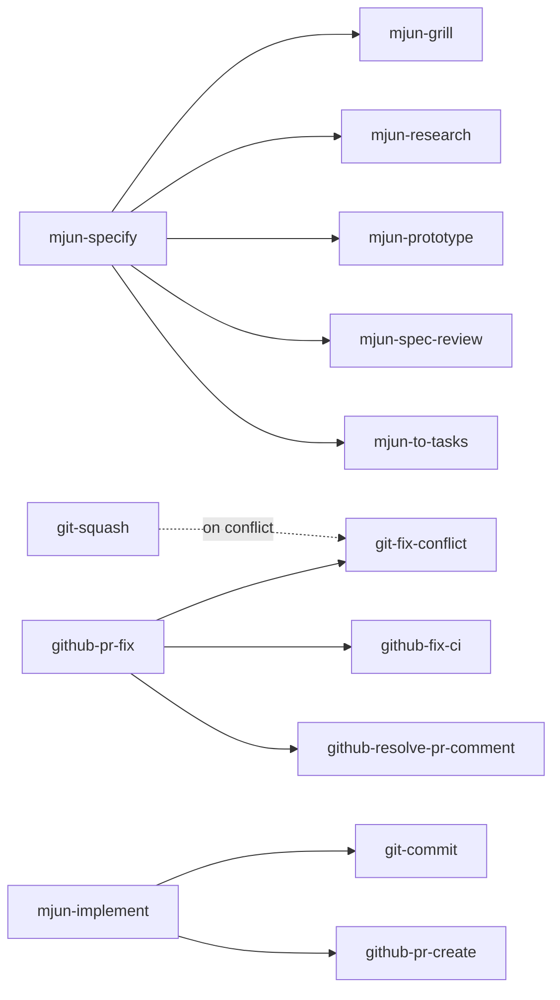

# Agent Skills

このドキュメントは、本リポジトリに同梱されているAI agent skillと、それらの依存関係について説明します。

Skillのソースは [`config/ai-agents/skills/`](../config/ai-agents/skills) 配下にあり、`install.sh` によって以下へsymlinkとしてデプロイされます。

- `~/.agents/skills/<skill>` — 共有skillディレクトリ
- `~/.claude/skills/<skill>` — Claude Code
- `~/.codex/skills/<skill>` — Codex
- `~/.gemini/antigravity-cli/skills/<skill>` — Antigravity CLI

`config/ai-agents/skills/` 配下のファイルを編集すると、symlink経由ですべてのagentに同時に反映されます。

## Skill一覧

各skillは `SKILL.md` を含むディレクトリです。Agentはfront-matterの `description` を読んで、いつ使うかを判断します。

### Development Flow (mjun)

`mjun-` prefixの自作開発フローskill群。specの正本は常に `.mjun/specs/` のLocal specで、GitHub Issueは取り込みと投影のアダプタとして扱う。入口は `mjun-specify` で、contract承認後に必要ならtask分解し、`mjun-implement` で実装からPRまで進める。

| Skill                                                                      | 用途                                                                                                                                                                                                                                                                                                                                                                                                                                                                                              |
| -------------------------------------------------------------------------- | ------------------------------------------------------------------------------------------------------------------------------------------------------------------------------------------------------------------------------------------------------------------------------------------------------------------------------------------------------------------------------------------------------------------------------------------------------------------------------------------------- |
| [`mjun-specify`](../config/ai-agents/skills/mjun-specify/SKILL.md)         | アイデア・GitHub Issue・ローカルMarkdownを実装可能なspec (contract) へ仕上げる。factsを調査してAgent権限内のdecisionを自分で決め、Human-ownedと判断に迷うdecisionを1問ずつ確認し、decisionの解決後にdesign.md (contract内の実装設計) を必ず書き、承認後に複数task規模ならtask分解を自動で行い、task一覧込みでIssueへ投影する (純Local specには投影時に投影先Issueの作成を提案する)。承認前に `mjun-spec-review` がcontractとdesign.mdをfresh contextで検査する                                    |
| [`mjun-grill`](../config/ai-agents/skills/mjun-grill/SKILL.md)             | 計画・設計・specの意思決定を1問ずつの対話で解決する (全分岐を解消する設計全体モードと、1件だけ解決する単一decisionモード)                                                                                                                                                                                                                                                                                                                                                                         |
| [`mjun-research`](../config/ai-agents/skills/mjun-research/SKILL.md)       | 一次資料 (公式ドキュメント・ソースコード・仕様書) から外部事実を調査し、主張ごとに出典を付けてLocal specへ記録し、GitHubへ投稿せず呼び出し元へ返す                                                                                                                                                                                                                                                                                                                                                |
| [`mjun-prototype`](../config/ai-agents/skills/mjun-prototype/SKILL.md)     | 会話では判断できないUI・状態・ロジックの設計質問を、使い捨ての試作品で検証する (1 prototype = 1 question)                                                                                                                                                                                                                                                                                                                                                                                         |
| [`mjun-spec-review`](../config/ai-agents/skills/mjun-spec-review/SKILL.md) | spec (`.mjun/specs/<slug>`、GitHub Issue / PR番号、設計Markdown、会話中の設計) のcontractと実装設計を敵対的にレビューする。fresh contextのcontract reviewer (自己整合・ACの検証可能性・sourceとの乖離・Evidenceの実在) とdesign reviewer (contractの充足・Boundaries・コードベースとの整合・失敗経路・Test Seam・構造の過不足) が候補を出し、候補ごとにverifierが実コードとcontractの明文で反証してconfirmedだけをチャットへ返す。ファイルは編集しない                                            |
| [`mjun-to-tasks`](../config/ai-agents/skills/mjun-to-tasks/SKILL.md)       | specを単独検証可能なvertical sliceのtaskへ分解し、単一taskを含めてtasks.mdへ永続化する。done taskのAcceptance Criteriaが変わった場合はreadyへ戻す。粒度は「1つの失敗コマンドでredにできる」「責務1つ」「前提は先行task」「Done when 1行」「AC ≤ 3」で判定する。各taskにSeamを持たせ、ファイルパスは書かない                                                                                                                                                                                       |
| [`mjun-implement`](../config/ai-agents/skills/mjun-implement/SKILL.md)     | specのcontract承認状態と内容を検査し (Issue番号はspecify済みspecへの逆引きで解決)、tasks.mdに記録したbranchからresumeしてtaskごとに実装する。specとtask双方のAcceptance Criteriaとcontract境界の照合を経てcommitと必要ならPRまで進める。taskごとにverifier SubAgentがAcceptance Criteriaを失敗する検査に落としてから実装し (検査はハッシュで改変検出)、収束しない失敗はfresh contextのdebuggerが分類してtask/specへ戻し、feature検証 (smoke、AC matrix、task間整合) とrefactor passを経て配送する |
| [`mjun-steering`](../config/ai-agents/skills/mjun-steering/SKILL.md)       | `.mjun/steering/` を実装にgroundされたproject memoryとして生成 (Bootstrap)・drift検出付きで追記更新 (Sync) する                                                                                                                                                                                                                                                                                                                                                                                   |
| [`mjun-status`](../config/ai-agents/skills/mjun-status/SKILL.md)           | `.mjun/specs/` とgitの内容からLocal specの状況 (contract承認、task進捗、実装branch、投影先Issue) を索引なしで導出して一覧・詳細表示する。読み取り専用                                                                                                                                                                                                                                                                                                                                             |

### Git

| Skill                                                                      | 用途                                                                                                                                    |
| -------------------------------------------------------------------------- | --------------------------------------------------------------------------------------------------------------------------------------- |
| [`git-commit`](../config/ai-agents/skills/git-commit/SKILL.md)             | 現在の変更を適切な単位でstaging・commitする                                                                                             |
| [`git-squash`](../config/ai-agents/skills/git-squash/SKILL.md)             | 現在のbranchのcommitをsquash・整理し、必要なら force-with-lease でpushする                                                              |
| [`git-fix-conflict`](../config/ai-agents/skills/git-fix-conflict/SKILL.md) | merge、rebase、cherry-pick、revert、apply、PR などで発生したコンフリクトを検出して解消する                                              |
| [`self-review`](../config/ai-agents/skills/self-review/SKILL.md)           | 未commit変更または指定commitをsnapshot化し、独立した2つのFinderで敵対的にreviewする (`--spec` でspecとの整合を検証するContract軸を追加) |

### GitHub

| Skill                                                                                        | 用途                                                                                                                                                                  |
| -------------------------------------------------------------------------------------------- | --------------------------------------------------------------------------------------------------------------------------------------------------------------------- |
| [`github-issue-create`](../config/ai-agents/skills/github-issue-create/SKILL.md)             | Todo・メモ・バグ報告を、主張の裏取り (repo、必要なら公式ドキュメント) と関連Issue検索をしてからGitHub Issueとして1件起票する (テンプレ・ラベル自動判定、承認後に作成) |
| [`github-issue-update`](../config/ai-agents/skills/github-issue-update/SKILL.md)             | open issueを横断的に点検してclose (解決済み・重複・stale)・コメント追記・ラベル変更の候補を提示し、承認後に一括反映する                                               |
| [`github-pr-create`](../config/ai-agents/skills/github-pr-create/SKILL.md)                   | 現在のbranchからPull Requestを作成し、概要・背景、関連Issue、実装方針、変更内容、影響範囲、検証結果の6項目で本文を記述する                                            |
| [`github-pr-review`](../config/ai-agents/skills/github-pr-review/SKILL.md)                   | 並列reviewerで要修正の指摘・規約違反・specとの不整合 (`--spec` または関連Issueから解決できる場合) を発見・検証し、以前のレビューを最新スナップショットへ置き換える    |
| [`github-pr-fix`](../config/ai-agents/skills/github-pr-fix/SKILL.md)                         | PRの全問題(コンフリクト、CI失敗、レビューコメント)を専用worktree内で検出・修正する                                                                                    |
| [`github-fix-ci`](../config/ai-agents/skills/github-fix-ci/SKILL.md)                         | CIのステータスを確認し、失敗を分析して修正を適用する                                                                                                                  |
| [`github-resolve-pr-comment`](../config/ai-agents/skills/github-resolve-pr-comment/SKILL.md) | PRのレビューコメントを確認し、対応・返信する                                                                                                                          |

### Planning & Design

| Skill                                                                    | 用途                                                                                       |
| ------------------------------------------------------------------------ | ------------------------------------------------------------------------------------------ |
| [`experiment-plan`](../config/ai-agents/skills/experiment-plan/SKILL.md) | 機械学習実験の未決事項を一つずつ確認し、検証可能な計画書を `.mjun/experiments/` へ保存する |

### Docs & Notes

| Skill                                                      | 用途                                                                                                       |
| ---------------------------------------------------------- | ---------------------------------------------------------------------------------------------------------- |
| [`doc-sync`](../config/ai-agents/skills/doc-sync/SKILL.md) | リポジトリ内のドキュメント（Markdown、docstring、OpenAPI、設定サンプル）を実装と差分比較し、乖離を更新する |
| [`md-note`](../config/ai-agents/skills/md-note/SKILL.md)   | 現在の会話の調査内容を、自己完結型の日本語Markdownファイルとして保存する                                   |

### Japanese Writing

| Skill                                                                                | 用途                                                                                                         |
| ------------------------------------------------------------------------------------ | ------------------------------------------------------------------------------------------------------------ |
| [`japanese-tech-writing`](../config/ai-agents/skills/japanese-tech-writing/SKILL.md) | 日本語の技術文書・書籍原稿を書く／推敲するときの文章規範（整形、パラグラフライティング、LLM 臭の排除など）   |
| [`stop-ai-slop-jp`](../config/ai-agents/skills/stop-ai-slop-jp/SKILL.md)             | AIで書いた日本語を人間が書いた文章に戻す編集規範（主体の不在、命題型H2、両論併記、リズムの均一さなどを直す） |

出典:

- `japanese-tech-writing` — [k16shikano/fd287c3133457c4fd8f5601d34aa817d](https://gist.github.com/k16shikano/fd287c3133457c4fd8f5601d34aa817d) を元にしている

### Cross-Agent Consultation & Delegation

これらはuser-invoked専用で、agentが自発的に起動することはありません。

デフォルトはread-onlyの相談モードで、ユーザーが作業の実行を明示的に依頼したときだけ編集権限付きの委譲モードで実行します。自分自身と同じCLIのskillは使いません。

| Skill                                                  | 用途                                                                                       |
| ------------------------------------------------------ | ------------------------------------------------------------------------------------------ |
| [`claude`](../config/ai-agents/skills/claude/SKILL.md) | Claude Code (`claude -p`) への相談 (read-only) と、編集権限付きの作業委譲                  |
| [`codex`](../config/ai-agents/skills/codex/SKILL.md)   | Codex (`codex exec`) への相談 (read-onlyサンドボックス) と、`workspace-write` での作業委譲 |

### Misc

| Skill                                                                          | 用途                                                                                                                                          |
| ------------------------------------------------------------------------------ | --------------------------------------------------------------------------------------------------------------------------------------------- |
| [`agent-browser`](../config/ai-agents/skills/agent-browser/SKILL.md)           | `agent-browser` CLIによるブラウザ自動化 (upstreamのstubをvendor。使い方は `agent-browser skills get core` で実行時に読み込む)                 |
| [`herdr`](../config/ai-agents/skills/herdr/SKILL.md)                           | herdr管理下のpaneからherdrのpane/tab/workspaceを操作する (バイナリ同梱版を `herdr --skill` でvendor。herdr更新時に `setup_herdr.sh` が再生成) |
| [`resume-other-agent`](../config/ai-agents/skills/resume-other-agent/SKILL.md) | 別のcoding agent（Codex / Claude Code）をsession IDで指定し、直前のcontextを復元してresumeする                                                |
| [`skill-review`](../config/ai-agents/skills/skill-review/SKILL.md)             | Agent skillの仕様適合性を検証し、周辺skillとの発動競合を含む観点ごとの判定をレポートする。評価のみで編集はしない                              |
| [`wezterm-control`](../config/ai-agents/skills/wezterm-control/SKILL.md)       | weztermのpane/tab/windowを `wezterm cli` で操作する。分割・フォーカス・リサイズ・内容の読み取り・コマンド送信と結果検証                       |

## Dependencies

以下のskillはagentの `Skill` tool経由で他のskillを呼び出します。矢印はcallerからcalleeへ向かいます。

```mermaid
graph LR
    git-squash -. on conflict .-> git-fix-conflict

    mjun-specify --> mjun-grill
    mjun-specify --> mjun-research
    mjun-specify --> mjun-prototype
    mjun-specify --> mjun-spec-review
    mjun-specify --> mjun-to-tasks

    mjun-implement --> git-commit
    mjun-implement --> github-pr-create

    github-pr-fix --> git-fix-conflict
    github-pr-fix --> github-fix-ci
    github-pr-fix --> github-resolve-pr-comment
```

### Caller → callee 表

| Caller           | Callee                                                           | タイミング                                                                     |
| ---------------- | ---------------------------------------------------------------- | ------------------------------------------------------------------------------ |
| `git-squash`     | `git-fix-conflict`                                               | squash中にコンフリクトが発生した場合のみ                                       |
| `mjun-specify`   | `mjun-grill`, `mjun-research`, `mjun-prototype`                  | Human-owned / Evidence-blockedなdecisionの解決が必要な場合                     |
| `mjun-specify`   | `mjun-spec-review`                                               | Phase 5.5 (承認前) でcontractとdesign.mdを検査し、妥当な指摘だけを反映         |
| `mjun-specify`   | `mjun-to-tasks`                                                  | contract承認後、複数task規模の場合と既存tasks.mdの再分解が必要な場合に自動連結 |
| `mjun-implement` | `git-commit`, `github-pr-create`                                 | Phase 4でworktreeの変更をcommitし、`--pr` 時にPRを作成                         |
| `github-pr-fix`  | `git-fix-conflict`, `github-fix-ci`, `github-resolve-pr-comment` | 対応する問題が検出された場合のみ各calleeを実行                                 |

### Standalone skills

以下のskillは他のskillへ委譲しません。

`agent-browser`, `claude`, `codex`, `doc-sync`, `experiment-plan`, `git-commit`, `git-fix-conflict`, `github-fix-ci`, `github-issue-create`, `github-issue-update`, `github-pr-create`, `github-pr-review`, `github-resolve-pr-comment`, `herdr`, `japanese-tech-writing`, `md-note`, `mjun-grill`, `mjun-prototype`, `mjun-research`, `mjun-spec-review`, `mjun-status`, `mjun-steering`, `mjun-to-tasks`, `resume-other-agent`, `self-review`, `skill-review`, `stop-ai-slop-jp`, `wezterm-control`.

## Conventions

- Skill名はkebab-caseで、ドメイン単位（`git-*`、`github-*`、いくつかの汎用skill）にスコープされます。
- Front matter（`name`、`description`、`allowed-tools`）はagentが読む契約です。`description` はskillが正しくトリガーされるよう十分に具体的に書き、本体から呼び出すsub-skillは `allowed-tools` に `Skill(<dep>)` として記載してください。
- `allowed-tools`などのクライアント固有fieldは未対応agentで無視される場合があります。指定する場合は対象クライアントの現行構文に従い、skillに必要なtoolとコマンド範囲だけを許可してください。
- 既存skillの挙動を拡張する場合は、ロジックを複製するのではなく `Skill` tool経由で元のskillを呼び出すことを優先してください。改善がすべてのagentに一箇所で行き渡ります。
